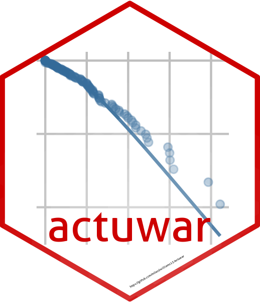
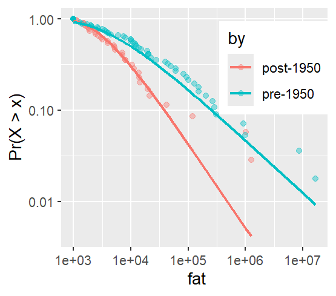

# {actuwar} 

     [](https://orcid.org/0000-0003-0192-5542)

An R package for estimating inverse Burr regression models for heavy-tailed data.

------------------------------------------------------------------------

The `{actuwar}` package allows users to estimate an inverse Burr regression model. Such models are useful for studying outcomes with thick-tailed distributions. The present package was motivated by a recent paper by [Cunen et al. (2020)](https://journals.sagepub.com/doi/10.1177/0022343319896843) who used the inverse Burr to model war fatalities. Their approach was sound, but it lacked a convenient API to make the method accessible for wider use.

## Installation

To install the latest development version of the package:

```         
library(devtools)
devtools::install_github("milesdwilliams15/actuwar")
```

The package currently is only available on GitHub. Any new updates that are made will be noted here.

## How to use

The `{actuwar}` package was designed with the end-user in mind. That means its workhorse function for estimating an inverse Burr regression model follows the same conventions as other regression model functions R users are accustomed to, such as `lm()`.

However, the inverse Burr is more complex than a simple linear regression where the goal is to model the conditional mean of an outcome. The inverse Burr has three parameters, a scale and two shape parameters, any of which can be left constant or conditioned on covariates. The interface for estimating the model, therefore, is a bit more involved—but only just. The below code snippet provides an example using the `wars` dataset (available with the `{actuwar}` package). The code works by specifying an outcome and then supplying up to three right-hand side only formula objects for each of the three model parameters: `mu` for the scale (or central tendency), `alpha` for the density to the left of the mode, and `theta` for the density to the right of the mode.

```         
library(actuwar)
data("wars") # use `wars` data object with {actuwar}

ibm(
  outcome = fat,
  mu = ~ log(pop) + maj + dem,
  alpha = ~ log(pop) + maj + dem,
  theta = ~ log(pop) + maj + dem,
  data = wars
) -> model_fit
```

The `ibm()` function (short for "inverse Burr model") has a few different settings that users may want to customize. First of all, the inverse Burr is estimated using maximum likelihood estimation (MLE), which is the recommended approach. However, in practice a finite Hessian is not always guaranteed, which is an issue if you want to have standard errors for model parameters. Therefore, the function automatically performs bootstrapping under the hood. This has the benefit of providing robust and consistent standard errors, but it costs some computational efficiency. Depending on the size of your data, run time could last several seconds to minutes (or even longer if your data is quite large). If this is an issue you can directly control the number of bootstrap iterations using the `its` command (the default is 2,000). You can also choose to run the bootstrapping in parallel. The `ibm()` function uses the `{furrr}` package to perform bootstrapping. Therefore, if you open the `{furrr}` package and set up your session with commands to set up parallel processing this will automatically be applied to `ibm()`'s bootstrapping, thus speeding up the process. For example, you might write code like this:

```         
## open {furrr} and set up for multiple sessions
library(furrr)
cores <- availableCores() - 1
plan(multisession, workers = cores)

## estimate the model
ibm(
  outcome = fat,
  mu = ~ log(pop) + maj + dem,
  alpha = ~ log(pop) + maj + dem,
  theta = ~ log(pop) + maj + dem,
  data = wars
) -> model_fit
```

You can also choose whether the `ibm()` function "talks" to you about the progress it's making in estimating the model by setting `verbose = FALSE`. The default is `TRUE`. As a matter of preference, some like having a visual cue that the model is working (especially if run time takes a while), but others would rather avoid the clutter.

To get the regression results, you can simply pull them from the fitted model object using `.$out`:

```         
model_fit$out

# A tibble: 12 × 6
   param term        estimate std.error statistic p.value
   <chr> <chr>          <dbl>     <dbl>     <dbl>   <dbl>
 1 mu    (Intercept)  -0.609     0.757     -0.804   0.422
 2 mu    log(pop)      0.744     1.23       0.607   0.544
 3 mu    maj          -0.779     0.795     -0.981   0.326
 4 mu    dem          -0.982     0.404     -2.43    0.016
 5 alpha (Intercept)   0.123     0.964      0.127   0.898
 6 alpha log(pop)      1.78      0.688      2.58    0.01 
 7 alpha maj          -0.170     0.655     -0.260   0.794
 8 alpha dem           0.445     0.285      1.56    0.118
 9 theta (Intercept)   0.436     0.591      0.738   0.46 
10 theta log(pop)     -0.377     0.261     -1.44    0.15 
11 theta maj          -0.113     0.134     -0.846   0.398
12 theta dem          -0.0138    0.0373    -0.370   0.712
```

## Visualizing data

`{actuwar}` includes additional functions to help with visualizing and summarizing outputs from estimated models.

The function `llplot()` is an opinionated wrapper for `ggplot()` that produces a log-log plot of an outcome variable of interest. Such plots are conventionally used when studying thick-tailed data to identify power-law-like patterns in the distribution. These work by putting the empirical values of the variable of interest on the x-axis and the Pr(X \> x) on the y in log-log space. Data with power-law tails will display a characteristic negative linear relationship. The below code shows how this works with the fatality measure in the `wars` dataset.

```         
llplot(wars, fat)
```


`llplot()` can do more than just visualize the empirical Pr(X \> x) for a single variable. You can also specify that you want to show values by different groups in the data. The below code shows the distribution of war deaths by whether the war started before or after 1950:

```         
llplot(wars, fat, by = post1950)
```


You can also indicate that you want to show the inverse Burr fit for the data (which works with or without grouping) by specifying `show_fit = TRUE`.

```         
llplot(wars, fat, by = post1950, show_fit = T)
```



## Simulating conditional distributions

Inverse Burr models are more complex than more conventional regression models. This makes interpretation of model estimates somewhat challenging. A better way is to generate log-log plots like the type shown above using simulated draws from an inverse Burr model fit with covariates.

You can use the `ibm_sim()` function to simulate random draws from a conditional inverse Burr distribution, and in combination with `llplot()` you can show the results. The below example shows how, based on the inverse Burr model for war deaths, the average democracy score among countries fighting a war conditions the distribution of potential battle deaths by war's end. By default, it performs 1,000 random draws for each combination of of model covariates you supply.

```         
## simulate draws for countries with different 
## average democracy scores
ibm_sim(
  model_fit,
  newdata = data.frame(
    pop = mean(wars$pop),
    maj = mean(wars$maj),
    dem = c(-5, 0, 5)
  )
) -> sim_data

library(ggplot2) # open to customize plot

## plot the conditional distributions
llplot(sim_data, pred, by = dem) +
  scale_color_gradient2(
    low = "red",
    mid = "gray",
    high = "blue",
    guide = "legend",
    breaks = c(-5, 0, 5)
  ) +
  labs(
    color = "Avg. Polity 2"
  ) +
  theme(
    legend.position = c(.2, .25),
    legend.title = element_text(size = 8)
  )
```


## Additional comments

If you notice any issues or bugs when using the package, you can create an issue on the package repo. You can also email the package creator at williamsmd\@denison.edu. Happy modeling!
