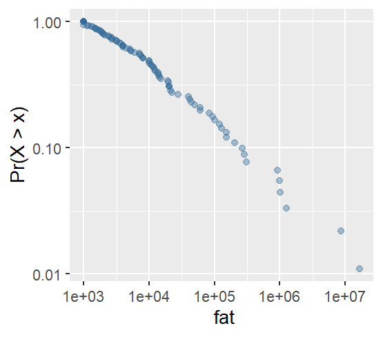
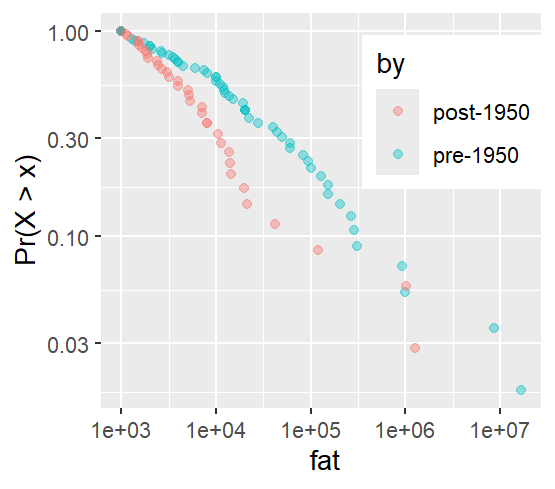
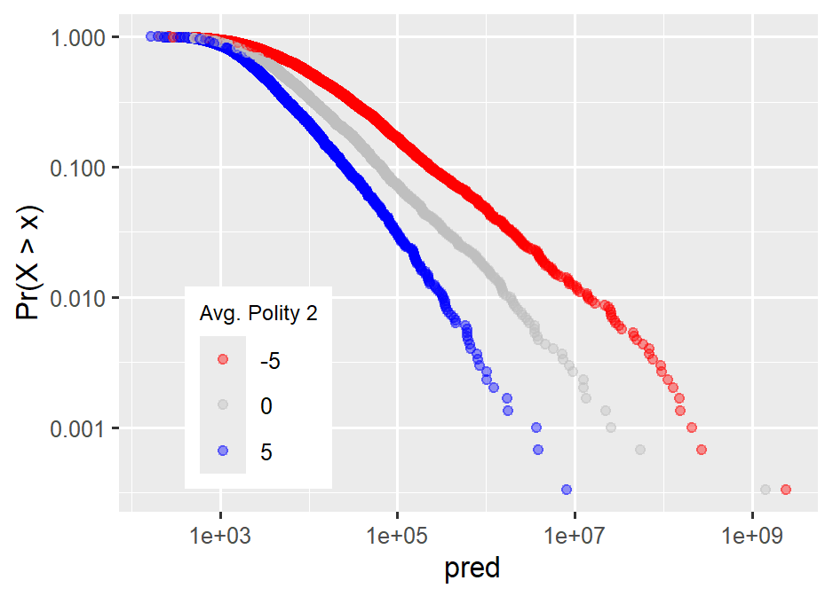

# {actuwar} 

     [](https://orcid.org/0000-0003-0192-5542)

An R package for estimating inverse Burr regression models for heavy-tailed data.

------------------------------------------------------------------------

The `{actuwar}` package allows users to estimate an inverse Burr regression model. Such models are useful for studying outcomes with thick-tailed distributions. The present package was motivated by a recent paper by [Cunen et al. (2020)](https://journals.sagepub.com/doi/10.1177/0022343319896843) who used the inverse Burr to model war fatalities. `{actuwar}` provides a convenient API to make their method accessible for wider use.

## Installation

To install the latest development version of the package:

```         
install.packages("devtools")
devtools::install_github("milesdwilliams15/actuwar")
```

The package currently is only available on GitHub. Any new updates that are made will be noted here.

## How to use

The `{actuwar}` package was designed with the end-user in mind. That means its workhorse function for estimating an inverse Burr regression model follows the same conventions as other regression model functions R users are accustomed to, such as `lm()`.

However, the inverse Burr is more complex than a simple linear regression where the goal is to model the conditional mean of an outcome. The inverse Burr has three parameters, a scale and two shape parameters, any of which can be left constant or conditioned on covariates. The interface for estimating the model, therefore, is a bit more involved—but only just. The below code snippet provides an example using the `wars` dataset (available with the `{actuwar}` package). The code works by specifying an outcome and then supplying up to three right-hand side only formula objects for each of the three model parameters: `mu` for the scale (or central tendency), `alpha` for dispersion, and `theta` for the thickness of the right-hand tail of the distribution.

```         
library(actuwar)
data("wars") # use `wars` data object with {actuwar}

ibm(
  outcome = fat,
  mu = ~ pop + maj + dem,
  alpha = ~ pop + maj + dem,
  theta = ~ pop + maj + dem,
  data = wars
) -> model_fit
```

The `ibm()` function (short for "inverse Burr model") has a few different settings that users may want to customize.

First of all, the inverse Burr is estimated using maximum likelihood estimation (MLE), which is the recommended approach. However, in practice a finite Hessian is not always guaranteed, which is an issue if you want to have standard errors for model parameters. Therefore, the function automatically performs bootstrapping under the hood. This has the benefit of providing robust and consistent standard errors, but at a loss to computational efficiency. Depending on the size of your data, run time could last several seconds to minutes (or even longer if your data is quite large). If this is an issue you can directly control the number of bootstrap iterations using the `its` command (the default is 2,000). To provide some efficiency boosts, the `ibm()` function uses the `{furrr}` package under the hood to perform bootstrapping, which gives you the option to set up parallel processing. For example, you might write code like this to run the bootstrapping across multiple R sessions at once:

```         
## open {furrr} and set up for multiple sessions
library(furrr)
cores <- availableCores() - 1
plan(multisession, workers = cores)

## estimate the model
ibm(
  outcome = fat,
  mu = ~ pop + maj + dem,
  alpha = ~ pop + maj + dem,
  theta = ~ pop + maj + dem,
  data = wars
) -> model_fit
```

You can also choose whether the `ibm()` function "talks" to you about the progress it's making in estimating the model by setting `verbose` to `TRUE` or `FALSE`. The default is `TRUE`. As a matter of preference, some like having a visual cue that the model is working (especially if run time takes a while), but others would rather avoid the clutter.

Finally, to see the regression results summary, you can pull it directly from the fitted model object using `.$summary`. (Note that in the below I rounded to 2 decimal points.)

```         
model_fit$summary

# A tibble: 12 × 6
   param term        estimate std.error statistic p.value
   <chr> <chr>          <dbl>     <dbl>     <dbl>   <dbl>
 1 mu    (Intercept)     0.51      1.18      0.43    0.66
 2 mu    pop             0.21      0.09      2.45    0.01
 3 mu    maj            -0.4       1.12     -0.35    0.72
 4 mu    dem             0.07      0.2       0.34    0.74
 5 alpha (Intercept)     2.11      1.01      2.09    0.04
 6 alpha pop             0.28      0.07      3.99    0.00   
 7 alpha maj            -2.2       0.82     -2.69    0.01
 8 alpha dem             0.02      0.13      0.16    0.88
 9 theta (Intercept)    -0.18      0.23     -0.81    0.42
10 theta pop             0.01      0.02      0.69    0.49
11 theta maj            -0.45      0.17     -2.69    0.01
12 theta dem             0.04      0.02      1.58    0.11
```

Other objects can be pulled out of the model as well: the empirical distribution of bootstrapped parameters (`.$boot_values`), the model data (`.$model_matrix`), the negative log likelihood (`.$logLik`), and a logical indicator of whether the model converged (`.$convergence`).

## Visualizing data

`{actuwar}` includes additional functions to help with visualizing and summarizing outputs from estimated models.

The function `llplot()` is an opinionated wrapper for `ggplot()` that produces a log-log plot of an outcome variable of interest. Such plots are conventionally used when studying thick-tailed data to identify power-law-like patterns in the distribution. These work by putting the empirical values of the variable of interest on the x-axis and the Pr(X \> x) on the y, both on the log scale. Data with power-law tails will display a characteristic negative linear relationship in the most extreme set of observations. The below code shows how this works with the fatality measure in the `wars` dataset.

```         
llplot(wars, fat)
```



`llplot()` will also let you specify that you want to show values by different groups in the data. The below code shows the distribution of war deaths by whether the war started before or after 1950:

```         
llplot(wars, fat, by = post1950)
```



You can also indicate that you want to show a simple inverse Burr fit for the data (which works with or without grouping) by specifying `show_fit = TRUE`.

```         
llplot(wars, fat, by = post1950, show_fit = T)
```


## Simulating conditional distributions

Inverse Burr models are more complex than conventional regression models. This makes interpretation of model estimates somewhat challenging. A better way is to generate log-log plots like the type shown above using simulated draws from an inverse Burr model fit with covariates.

You can use the `ibm_sim()` function to simulate random draws from a conditional inverse Burr distribution, and in combination with `llplot()` you can show the results. The below example shows how, based on the inverse Burr model for war deaths, the average democracy score among countries fighting a war conditions the distribution of potential battle deaths by war's end. By default, it performs 1,000 random draws for each combination of model covariates you supply. Like `ibm()`, it uses `{furrr}` under the hood, so it also supports parallel processing.

```         
## simulate draws for countries with different 
## average democracy scores
ibm_sim(
  model_fit,
  newdata = data.frame(
    pop = mean(wars$pop),
    maj = mean(wars$maj),
    dem = c(-5, 0, 5)
  )
) -> sim_data

## plot the conditional distributions
llplot(sim_data, pred, by = dem) +
  scale_color_gradient2(
    low = "red",
    mid = "gray",
    high = "blue",
    guide = "legend",
    breaks = c(-5, 0, 5)
  ) +
  labs(
    color = "Avg. Polity 2"
  ) +
  theme(
    legend.position = c(.2, .25),
    legend.title = element_text(size = 8)
  )
```



`ibm_sim()` gives you the option to factor in parameter uncertainty into your simulation as well. You can control this with the `se` option. The default is `FALSE`. Setting to `TRUE` means that model coefficients used for simulations are randomly drawn from the empirical distribution of bootstrapped coefficients saved with the `ibm()` output. While the choice is up to the user, accounting for parameter uncertainty can offer a more representative range of simulated values that are consistent with the data. You can see an example below:

```         
## simulate draws for countries with different 
## average democracy scores (set se = TRUE)
ibm_sim(
  model_fit,
  newdata = data.frame(
    pop = mean(wars$pop),
    maj = mean(wars$maj),
    dem = c(-5, 0, 5)
  ),
  se = T
) -> sim_data

## plot the conditional distributions
llplot(sim_data, pred, by = dem) +
  scale_color_gradient2(
    low = "red",
    mid = "gray",
    high = "blue",
    guide = "legend",
    breaks = c(-5, 0, 5)
  ) +
  labs(
    color = "Avg. Polity 2"
  ) +
  theme(
    legend.position = c(.2, .25),
    legend.title = element_text(size = 8)
  )
```


## Inferring Pr(X \> x)

A common quantity of interest when working with thick-tailed data is Pr(X \> x), or the probability that an event will be larger than some threshold. `{actuwar}` has a function called `boot_p()` that lets users compute this quantity, either with the raw data or with simulated data generated using `ibm_sim()`. `boot_p()` performs bootstrapping under the hood for interference, and by default it returns 95% bootstrap quantile intervals along with a point estimate for Pr(X \> x). These values are returned in a data frame and denoted by the columns `estimate`, `lower`, and `upper`. If the data frame giving to `boot_p()` was grouped, the grouping columns and their values will be returned as well. By default, it does 1,000 bootstrap iterations, and like `ibm()` and `ibm_sim()` it uses `{furrr}` under the hood, supporting parallel processing.

The below example shows how this function can be used with the raw data. Note that it works with `group_by()` since the function uses `summarize()` from `{dplyr}` under the hood to summarize the results.

```         
wars |>
  group_by(post1950) |>
  boot_p(fat, thresh = 1e06, ci = 0.834) |>
  ggplot() +
  aes(post1950, estimate, ymin = lower, ymax = upper) +
  geom_pointrange()
```


When giving `boot_p()` data simulated from a model fit, you can use it to show how model covariates condition the risk of wars larger than some magnitude of interest (like the near 16 million battle deaths recorded for WWII). The below results suggest that the chances of such a war are small, but significantly higher for wars involving autocracies, followed by democracies and then anocracies.

```         
sim_data |>
  group_by(dem) |>
  boot_p(pred, thresh = 16e06, ci = 0.834) |>
  ggplot() +
  aes(as.factor(dem), estimate, ymin = lower, ymax = upper) +
  geom_pointrange()
```


## Additional comments

If you notice any issues or bugs when using the package, you can create an issue on the package repo. You can also email the package creator at williamsmd\@denison.edu. Happy modeling!
